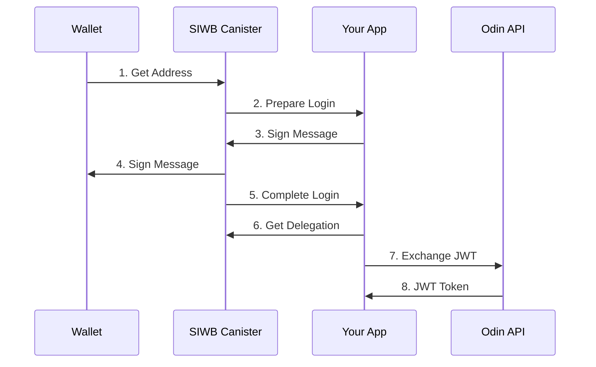

<Info>If you are already familiar with ICP Identities, you can skip this step.</Info>

Welcome to the Odin quickstart guide! In this step-by-step tutorial, you'll learn how to integrate Bitcoin-based authentication into your application using Odin's Sign-In-With-Bitcoin (SIWB) system.

By the end of this guide, you'll have built a complete SDK that can:
- Authenticate users with their Bitcoin wallets
- Generate Internet Computer identities
- Obtain API tokens for Odin services

## Understanding Odin Authentication




### Authentication Flow Explained

The Odin authentication process follows these steps:

<Steps>
<Step title="Address Retrieval">
  Your wallet provides its Bitcoin address to the SIWB (Sign-In with Bitcoin) canister. This establishes the identity that will be used for authentication.
</Step>

<Step title="Login Preparation">
  The SIWB canister generates a unique challenge message and sends it to your application. This message contains cryptographic data that proves the request's authenticity.
</Step>

<Step title="Message Signing Request">
  Your application receives the challenge message and requests the user's wallet to sign it. This step verifies that the user controls the private key associated with their Bitcoin address.
</Step>

<Step title="Wallet Signature">
  The wallet signs the challenge message using the user's private key, creating a cryptographic proof of ownership without exposing the private key itself.
</Step>

<Step title="Login Completion">
  The signed message is sent back to the SIWB canister, which verifies the signature against the Bitcoin address. If valid, the authentication is approved.
</Step>

<Step title="Delegation Creation">
  Your application requests a delegation from the SIWB canister. This delegation acts as a temporary identity that can interact with Internet Computer services.
</Step>

<Step title="JWT Exchange">
  Your application exchanges the delegation for a JWT (JSON Web Token) from the Odin API. This token contains the user's authenticated identity and permissions.
</Step>

<Step title="Access Token Received">
  The Odin API returns a JWT token that your application can use to authenticate all subsequent requests to Odin services.
</Step>
</Steps>

<Tip>
This process ensures that users maintain control of their Bitcoin private keys while securely authenticating with Odin services through the Internet Computer infrastructure.
</Tip>

Odin supports multiple authentication methods and Bitcoin wallets. You can see all supported options on our website:

<Frame>

</Frame>

<Info>
This tutorial focuses on Bitcoin wallet authentication through Node.js. For web applications, we recommend checking out [Laser Eyes](https://demo.lasereyes.build/) for easier wallet integration.
</Info>

## Prerequisites

Make sure you have the following installed before starting:

<CardGroup cols={2}>
<Card title="Node.js" icon="node-js">
  Node.js 18.0.0 or higher
</Card>

<Card title="TypeScript" icon="code">
  TypeScript 5.0.0 or higher (recommended)
</Card>
</CardGroup>


## Install Dependencies

First, install the required Internet Computer libraries:

```bash
npm install @dfinity/agent @dfinity/identity @dfinity/principal
```

## SIWB Canister Integration

### Import Canister Interface

Let's start by setting up the SIWB canister interface. You can reference the contract and download the interface from the [Internet Computer Dashboard](https://dashboard.internetcomputer.org/canister/bcxqa-kqaaa-aaaak-qotba-cai).

<Tabs>
<Tab title="IDL Factory">
```typescript canister/ic_siwb_provider.idl.ts
export const idlFactory = ({ IDL }: any) => {
	const Principal = IDL.Vec(IDL.Nat8)
	const String = IDL.Text
	const Address = IDL.Text
	const GetAddressResponse = IDL.Variant({ Ok: Address, Err: IDL.Text })
	const GetPrincipalResponse = IDL.Variant({
		Ok: Principal,
		Err: IDL.Text,
	})
	const PublicKey = IDL.Vec(IDL.Nat8)
	const SessionKey = PublicKey
	const Timestamp = IDL.Nat64
	const Delegation = IDL.Record({
		pubkey: PublicKey,
		targets: IDL.Opt(IDL.Vec(IDL.Principal)),
		expiration: Timestamp,
	})
	const SignedDelegation = IDL.Record({
		signature: IDL.Vec(IDL.Nat8),
		delegation: Delegation,
	})
	const GetDelegationResponse = IDL.Variant({
		Ok: SignedDelegation,
		Err: IDL.Text,
	})
	const SiwbSignature = IDL.Text
	const PublickeyHex = IDL.Text
	const SignMessageType = IDL.Variant({
		Bip322Simple: IDL.Null,
		ECDSA: IDL.Null,
	})
	const CanisterPublicKey = PublicKey
	const LoginDetails = IDL.Record({
		user_canister_pubkey: CanisterPublicKey,
		expiration: Timestamp,
	})
	const LoginResponse = IDL.Variant({ Ok: LoginDetails, Err: IDL.Text })
	const SiwbMessage = IDL.Text
	const PrepareLoginResponse = IDL.Variant({
		Ok: SiwbMessage,
		Err: IDL.Text,
	})
	return IDL.Service({
		get_address: IDL.Func([Principal, String], [GetAddressResponse], ["query"]),
		get_caller_address: IDL.Func(
			[IDL.Opt(String)],
			[GetAddressResponse],
			["query"],
		),
		get_principal: IDL.Func([Address], [GetPrincipalResponse], ["query"]),
		siwb_get_delegation: IDL.Func(
			[Address, SessionKey, Timestamp],
			[GetDelegationResponse],
			["query"],
		),
		siwb_login: IDL.Func(
			[SiwbSignature, Address, PublickeyHex, SessionKey, SignMessageType],
			[LoginResponse],
			[],
		),
		siwb_prepare_login: IDL.Func([Address], [PrepareLoginResponse], []),
	})
}
export const init = ({ IDL }: any) => {
	const RuntimeFeature = IDL.Variant({
		IncludeUriInSeed: IDL.Null,
		DisableEthToPrincipalMapping: IDL.Null,
		DisablePrincipalToEthMapping: IDL.Null,
	})
	const SettingsInput = IDL.Record({
		uri: IDL.Text,
		runtime_features: IDL.Opt(IDL.Vec(RuntimeFeature)),
		domain: IDL.Text,
		statement: IDL.Opt(IDL.Text),
		scheme: IDL.Opt(IDL.Text),
		salt: IDL.Text,
		network: IDL.Opt(IDL.Text),
		session_expires_in: IDL.Opt(IDL.Nat64),
		targets: IDL.Opt(IDL.Vec(IDL.Text)),
		sign_in_expires_in: IDL.Opt(IDL.Nat64),
	})
	return [SettingsInput]
}
```
</Tab>

<Tab title="TypeScript Types">
```typescript canister/ic_siwb_provider.d.ts
import type { Principal } from "@dfinity/principal"
import type { ActorMethod } from "@dfinity/agent"
import type { IDL } from "@dfinity/candid"

export type Address = string
export type CanisterPublicKey = PublicKey
export interface Delegation {
	pubkey: PublicKey
	targets: [] | [Array<Principal>]
	expiration: Timestamp
}
export type GetAddressResponse = { Ok: Address } | { Err: string }
export type GetDelegationResponse = { Ok: SignedDelegation } | { Err: string }
export type GetPrincipalResponse = { Ok: Principal } | { Err: string }
export interface LoginDetails {
	user_canister_pubkey: CanisterPublicKey
	expiration: Timestamp
}
export type LoginResponse = { Ok: LoginDetails } | { Err: string }
export type PrepareLoginResponse = { Ok: SiwbMessage } | { Err: string }
export type Principal = Uint8Array | number[]
export type PublicKey = Uint8Array | number[]
export type PublickeyHex = string
export type RuntimeFeature =
	| { IncludeUriInSeed: null }
	| { DisableEthToPrincipalMapping: null }
	| { DisablePrincipalToEthMapping: null }
export type SessionKey = PublicKey
export interface SettingsInput {
	uri: string
	runtime_features: [] | [Array<RuntimeFeature>]
	domain: string
	statement: [] | [string]
	scheme: [] | [string]
	salt: string
	network: [] | [string]
	session_expires_in: [] | [bigint]
	targets: [] | [Array<string>]
	sign_in_expires_in: [] | [bigint]
}
export type SignMessageType = { Bip322Simple: null } | { ECDSA: null }
export interface SignedDelegation {
	signature: Uint8Array | number[]
	delegation: Delegation
}
export type SiwbMessage = string
export type SiwbSignature = string
export type String = string
export type Timestamp = bigint
export interface _SERVICE {
	get_address: ActorMethod<[Principal, String], GetAddressResponse>
	get_caller_address: ActorMethod<[[] | [String]], GetAddressResponse>
	get_principal: ActorMethod<[Address], GetPrincipalResponse>
	siwb_get_delegation: ActorMethod<
		[Address, SessionKey, Timestamp],
		GetDelegationResponse
	>
	siwb_login: ActorMethod<
		[SiwbSignature, Address, PublickeyHex, SessionKey, SignMessageType],
		LoginResponse
	>
	siwb_prepare_login: ActorMethod<[Address], PrepareLoginResponse>
}
export declare const idlFactory: IDL.InterfaceFactory
export declare const init: (args: { IDL: typeof IDL }) => IDL.Type[]

```
</Tab>

<Tab title="Service Interface">
```typescript canister/service.interface.d.ts
import type { ActorMethod } from "@dfinity/agent"
import type { Principal } from "@dfinity/principal"
export type Address = string
export type PublickeyHex = string
export type CanisterPublicKey = PublicKey
export interface Delegation {
	pubkey: PublicKey
	targets: [] | [Array<Principal>]
	expiration: Timestamp
}
export type GetDelegationResponse =
	| {
			Ok: SignedDelegation
	  }
	| {
			Err: string
	  }
export interface LoginOkResponse {
	user_canister_pubkey: CanisterPublicKey
	expiration: Timestamp
}
export type LoginResponse =
	| {
			Ok: LoginOkResponse
	  }
	| {
			Err: string
	  }
export type PrepareLoginResponse =
	| {
			Ok: SiwbMessage
	  }
	| {
			Err: string
	  }
export type PublicKey = Uint8Array | number[]
export type SessionKey = PublicKey
export interface SignedDelegation {
	signature: Uint8Array | number[]
	delegation: Delegation
}
export type SignMessageType =
	| {
			Bip322Simple: null
	  }
	| {
			ECDSA: null
	  }
export type SiwbMessage = string
export type SiwbSignature = string
export type Timestamp = bigint
export interface SIWB_IDENTITY_SERVICE {
	siwb_prepare_login: ActorMethod<[Address], PrepareLoginResponse>
	siwb_login: ActorMethod<
		[SiwbSignature, Address, PublickeyHex, SessionKey, SignMessageType],
		LoginResponse
	>
	siwb_get_delegation: ActorMethod<
		[Address, SessionKey, Timestamp],
		GetDelegationResponse
	>
}

```
</Tab>
</Tabs>

<Tip>
For production deployments, you'll need to deploy your own SIWB contract to the Internet Computer.
</Tip>

## Configuration Setup

Create the necessary configuration files for your project:

<CodeGroup>
```typescript constants/canister.ts
// SIWB canister ID for Sign-In With Bitcoin
export const SIWB_CANISTER_ID = 'bcxqa-kqaaa-aaaak-qotba-cai';

// Internet Computer host URLs
export const IC_HOST = {
    mainnet: 'https://ic0.app',
    local: 'http://localhost:4943',
  } as const;

// Default IC host
export const DEFAULT_IC_HOST = IC_HOST.mainnet;
```

```typescript types/siwb.ts
/**
 * SIWB Canister Types
 */

import { PublicKey } from '@/canister/service.interface';

export type SIWBAddress = string;
export type SIWBSignature = string; // Base64 encoded signature string
export type SIWBPublicKey = string; // Hex encoded public key string
export type SIWBSessionKey = Uint8Array;

export type SignatureType = 'Bip322Simple';

export interface SIWBLoginDetails {
  user_canister_pubkey: PublicKey;
  expiration: bigint;
}

export type SIWBPrepareLoginResponse =
  | {
      Ok: string;
    }
  | {
      Err: string;
    };

export type SIWBLoginResponse =
  | {
      Ok: SIWBLoginDetails;
    }
  | {
      Err: string;
    };

export interface SIWBDelegation {
  signature: SIWBSignature;
  delegation: {
    pubkey: SIWBPublicKey;
    expiration: bigint;
    targets?: Array<import('@dfinity/principal').Principal>;
  };
}

export type SIWBGetDelegationResponse =
  | {
      Ok: SIWBDelegation;
    }
  | {
      Err: string;
    };

export type SIWBSignMessageType = {
  Bip322Simple: null;
};

/**
 * SIWB Actor Interface
 */
export interface SIWBActor {
  siwb_prepare_login: (address: SIWBAddress) => Promise<SIWBPrepareLoginResponse>;
  siwb_login: (
    signature: SIWBSignature,
    address: SIWBAddress,
    publicKey: SIWBPublicKey,
    sessionKey: SIWBSessionKey,
    signMessageType: SIWBSignMessageType
  ) => Promise<SIWBLoginResponse>;
  siwb_get_delegation: (
    address: SIWBAddress,
    sessionKey: SIWBSessionKey,
    expiration: bigint
  ) => Promise<SIWBGetDelegationResponse>;
}

```
</CodeGroup>

## Implementing Phase 1: Prepare Authentication

Let's implement the first phase where we request a message to sign from the SIWB canister:

```typescript core/prepare.ts
import { Actor, HttpAgent } from "@dfinity/agent";
import { DEFAULT_IC_HOST, SIWB_CANISTER_ID } from "../constants/canister";
import { idlFactory as SIWBIdlFactory } from '../canister/ic_siwb_provider.idl';
import { SIWBActor, SIWBPrepareLoginResponse } from "../types/siwb";

/**
 * Result from the prepare authentication phase
 */
export interface PrepareResult {
    /** Bitcoin address used for authentication */
    address: string;
  
    /** Message to be signed by the wallet */
    message: string;
  }

/**
   * Phase 1: Prepare authentication and get message to sign
   */
export const prepare = async (address: string): Promise<PrepareResult> => {
    // Create anonymous agent for SIWB canister
    const agent = new HttpAgent({ host: DEFAULT_IC_HOST });

    // Create SIWB actor
    const siwbActor = Actor.createActor(SIWBIdlFactory, {
      agent,
      canisterId: SIWB_CANISTER_ID,
    }) as SIWBActor;

    // Call the SIWB canister's prepare login method
    const response: SIWBPrepareLoginResponse = await siwbActor.siwb_prepare_login(address);

    if ('Err' in response) {
      throw new Error(`SIWB prepare login failed: ${response.Err}`);
    }

    const message = response.Ok;

    return {
      address,
      message,
    };
  }
```

## Testing the Prepare Function

Let's test our preparation function with a sample Bitcoin address:

```typescript index.ts
import { prepare } from "./core/prepare";

(async () => {
    const result = await prepare('bc1pp65gjez7q2dqcnuw4pavdr3udkx9llwv5x5jg42r5xm9ftm04dgs7ggq0z');
    console.log(result);
})();
```

Run the test:

```bash
npx tsx index.ts
```

<ResponseExample>
```js Expected Output
{
  address: 'bc1pp65gjez7q2dqcnuw4pavdr3udkx9llwv5x5jg42r5xm9ftm04dgs7ggq0z',
  message: 'odin.fun wants you to sign in with your Bitcoin account:\n' +
    'bc1pp65gjez7q2dqcnuw4pavdr3udkx9llwv5x5jg42r5xm9ftm04dgs7ggq0z\n' +
    '\n' +
    'Welcome to ODIN\n' +
    '\n' +
    'URI: https://odin.fun\n' +
    'Version: 1\n' +
    'Network: bitcoin\n' +
    'Nonce: 4e6f7420696e20757365\n' +
    'Issued At: 2025-07-21T17:52:30.575095182Z\n' +
    'Expiration Time: 2025-07-21T17:57:30.575095182Z'
}
```
</ResponseExample>

<Check>
Great! You've successfully implemented the first phase of SIWB authentication. The function returns a message that needs to be signed with your Bitcoin wallet.
</Check>

## What's Next?

In the next step, you'll learn how to:
- Sign the message with a Bitcoin wallet
- Complete the authentication process
- Generate an Internet Computer identity

<Card title="Continue to Step 2" icon="arrow-right" href="/quickstart/quickstart-02-siwb-login">
  Learn how to complete the SIWB login process with message signing
</Card>

